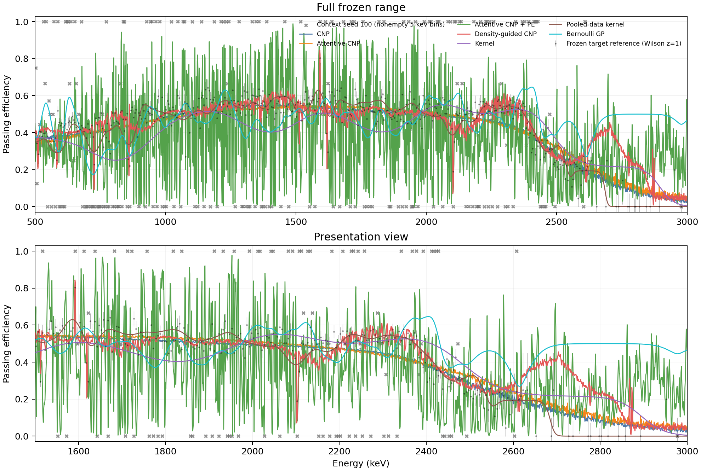

# Density-Guided Conditional Neural Processes for Detector Efficiency Estimation

Official code and artifact for:

> **Density-Guided Conditional Neural Processes for Detector Efficiency Estimation**
>
> Yue Ma and Aobo Li
>
> [arXiv:2609.13593](https://arxiv.org/abs/2609.13593)

This paper studies how to estimate the energy-dependent efficiency of a fixed
detector selection when calibration data are limited. Strong smoothing can
erase narrow physical changes, while unrestricted flexible models can reproduce
finite-sample fluctuations. We introduce a density-guided conditional neural
process (CNP) that allocates high-frequency flexibility near spectral
concentrations and restricts it in broad continuum regions.



The repository contains the waveform-classifier pipeline, all four neural
architectures, kernel and Bernoulli-GP comparators, frozen paper protocols,
training-budget and mechanism controls, compact numerical results, figures,
tests, and provenance. Raw data, checkpoints, and event-level predictions are
not stored in Git.

## The measurement problem

Selection efficiency connects observed passing counts to underlying event
rates. For a frozen classifier score `s`, threshold `T`, and energy `E`, the
paper estimates

```text
beta(E; T) = P(s >= T | E).
```

The application uses public Majorana Demonstrator thorium-calibration data.
The spectrum contains sharp changes around the 1592-keV double-escape peak,
the 1620-keV feature, the 2103-keV single-escape peak, and the 2614-keV
full-energy peak, superimposed on a broad continuum. These regions have
different event topologies and classifier passing probabilities.

The target is the efficiency of the fixed selection on this calibration
mixture. It is not the efficiency of a pure signal class, a cross-section
measurement, or evidence of transfer to another experiment.

Historical source files and schema keys use the word `acceptance` for this
same estimand. New paper text and figure labels use **efficiency**.

## Method

All conditional models observe context events

```text
context = {(energy_i, threshold, pass_i)},
pass_i = 1[classifier_score_i >= threshold],
```

and predict efficiency at target energies. CNP uses mean pooling. Attentive
CNP makes the context summary query-dependent. Attentive CNP + PE adds ten
Fourier frequency levels, which improve some narrow features but can introduce
large off-feature discrepancies.

The density-guided CNP uses only the matching efficiency-training pool to
construct narrow and broad spectral kernel sums. Their contrast

```text
R(E) = (sigma_global / sigma_local)
       * A_local(E) / (A_global(E) + epsilon)
```

is near one in a populated flat spectrum and increases near narrow spectral
concentrations. The model uses this contrast in three places:

1. A density-dependent decoder gate controls which Fourier frequencies are
   available at each query energy.
2. Density-dependent attention maps control the learned context bandwidth and
   temperature.
3. The decoder receives the density contrast directly.

The central decoder rule is

```text
lambda(E) = kappa + (10 - kappa) * sigmoid(10 * (R(E) - 3))
w_l(E)    = sigmoid(5 * (lambda(E) - l)),  l = 0, ..., 9,
```

where the learned background cutoff `kappa` is constrained to `(1, 5)`. The
local and broad density widths are 1 and 50 keV. Density uses training events
only; final context and reference events never enter the density buffer.

The full architecture and fixed constants are described in the paper
supplement and implemented in [`majorana_acp/`](majorana_acp/). The controlled
mechanism variants are isolated in
[`ml4phy-paper/review_followup_20260910/`](ml4phy-paper/review_followup_20260910/).

## Experimental protocol

The classifier and its threshold remain fixed in every efficiency-model
comparison. Event counts below are unique events, not repeated optimizer draws.

| Role | Events |
| --- | ---: |
| Eligible classifier source | 377,330 |
| Classifier training | 18,866 |
| Efficiency-model training budgets | 2,000 / 5,000 / 10,000 |
| Sampler-eligible events in the original budgets | 1,895 / 4,984 / 9,980 |
| Threshold calibration | 2,000 |
| Development context pool / targets | 3,000 / 2,074 |
| Final context reservoir | 20,000 |
| Context per final evaluation | 500 |
| Shared final reference | 114,400 |

The classifier is trained for 50 epochs on a fixed 5% subset of the 377,330
eligible source events. Efficiency-model subsets reuse classifier-training
events; they are not additional measured events. Neural models use 3,000 Adam
steps, three initialization seeds, ten shared context draws, and 50
dropout-active prediction passes. The original 2k/5k/10k subsets are nested
prefixes of an outcome-blind ordering, with two additional outcome-blind 5k
subsets for robustness.

The classical comparators are:

- Gaussian kernel regression, equivalently a properly normalized common-
  bandwidth KDE ratio, fitted to the 500 context events.
- A Laplace Bernoulli Gaussian-process classifier fitted to the same context.
- A separately labeled pooled-kernel control using the full 18,866-event
  training pool plus context, and therefore a stronger data budget.

## Evaluation metric

The frozen reference is divided into 5-keV bins. For each bin with at least
four reference events, the prediction is averaged at the actual event energies.
Let `f_b` be the measured passing fraction and `s_b` the half-width of its
`z = 1` Wilson interval. The paper reports

```text
C_k = percentage of supported bins satisfying |prediction_b - f_b| <= k * s_b.
```

`C2` is the primary compact view. Peaks equally averages the four two-bin peak
cores. Continuum equally averages the 1700--2000 and 2200--2400 keV windows.
Overall covers 442 supported bins from 500 to 3000 keV.

`C_k` is **reference-band agreement**, not calibrated model-interval coverage
and not coverage of an unknown true efficiency. A model can also increase
agreement by being inaccurate in a way hidden by regional pooling, so the
artifact retains per-bin residuals, continuous errors, passing-count
differences, curves, and C1/C3 sensitivity.

## Main results

### Local recovery and continuum agreement

All neural models below use the original 5k efficiency-training subset and 500
context events. Values are mean C2 percentages with descriptive seed SD in
parentheses. Classical rows summarize their ten contexts.

| Model | Peaks | Continuum | DE 1592 | Feature 1620 | SE 2103 | FE 2614 | Overall |
| --- | ---: | ---: | ---: | ---: | ---: | ---: | ---: |
| CNP | 23 (9) | 73 (7) | 50 | 0 | 0 | 43 | 80 |
| Attentive CNP | 18 (7) | 66 (9) | 50 | 0 | 0 | 20 | 75 |
| Attentive CNP + PE | 41 (3) | 37 (6) | 17 | 60 | 72 | 17 | 36 |
| **Density-guided CNP** | **45 (13)** | **89 (1)** | **100** | 50 | 17 | 13 | **80** |
| Kernel | 12 (10) | 63 (20) | 35 | 0 | 5 | 10 | 57 |
| Bernoulli GP | 11 (11) | 61 (19) | 35 | 5 | 5 | 0 | 55 |
| Kernel, pooled 18.9k | 36 (4) | 87 (2) | 30 | 20 | 45 | 50 | 75 |

The density-guided model offers the best joint peak/continuum balance in this
comparison. Its peak advantage over unrestricted PE comes from the double-
escape core; PE remains better at several individual peaks. The result is not
superiority in every region.

### Efficiency-model training budget

The classifier and 500-event contexts are fixed. Entries are mean C2
percentages with seed SD.

| Model | 2k Peaks | 2k Continuum | 5k Peaks | 5k Continuum | 10k Peaks | 10k Continuum |
| --- | ---: | ---: | ---: | ---: | ---: | ---: |
| CNP | 27 (1) | 82 (9) | 23 (9) | 73 (7) | 22 (8) | 77 (3) |
| Attentive CNP | 12 (0) | 78 (8) | 18 (7) | 66 (9) | 26 (13) | 74 (3) |
| Attentive CNP + PE | 22 (11) | 26 (2) | 41 (3) | 37 (6) | 51 (5) | 49 (7) |
| **Density-guided CNP** | 13 (9) | 42 (2) | **45 (13)** | **89 (1)** | 42 (14) | 88 (2) |

With 5k efficiency-training events, the density-guided model exceeds 10k CNP
and Attentive CNP on both joint summaries. Against 10k Attentive CNP + PE, it
trades lower peak agreement for much higher continuum agreement. The 2k model
fails, and performance from 5k to 10k is nonmonotonic. These observations do
not establish an exact minimum data requirement.

Across the three 5k training subsets, density-guided Peaks C2 ranges from 33%
to 50% and Continuum C2 from 80% to 89%. The subsets overlap because they come
from one finite parent pool; the ranges are not confidence intervals.

### Mechanism controls

The controls share the original 5k subset, three seeds, and ten contexts.

| Variant | Peaks C2 | Continuum C2 |
| --- | ---: | ---: |
| **Full density guidance** | **45 (13)** | **89 (1)** |
| Global decoder gate | 21 (7) | 82 (3) |
| Global attention | 46 (16) | 89 (1) |
| Global gate + attention | 23 (3) | 82 (3) |
| Density-free global | 20 (1) | 87 (4) |

Replacing the adaptive decoder gate with one learned global cutoff reduces both
primary summaries in every seed mean. Replacing adaptive attention with learned
global settings leaves them nearly unchanged. The evidence therefore supports
density-adaptive decoder gating most clearly; it does not establish an
independent gain from every density pathway.

## What this repository provides

- The waveform CNN, CNP, attentive CNP, positional encoding, density-guided
  model, samplers, losses, and evaluation code.
- Frozen classifier, context, threshold, training-subset, and reference
  protocols with unique-event counts and identity hashes.
- Matched neural training and evaluation runners for three seeds and shared
  contexts.
- Context-only kernel and Bernoulli-GP baselines plus the pooled-kernel control.
- The 2k/5k/10k data-budget campaigns and three 5k subset orderings.
- The four mechanism controls and checkpoint-restoration regression tests.
- Paper-facing tables, curves, residual diagnostics, figures, reports, and
  provenance manifests.
- A standard-library verifier that checks the portable artifact without raw
  data, checkpoints, or event-level predictions.

Start with [`ml4phy-paper/README.md`](ml4phy-paper/README.md) for the mapping
from paper figures and tables to exact repository files.

## Repository structure

| Path | Contents |
| --- | --- |
| [`majorana_acp/`](majorana_acp/) | Reusable data, model, training, evaluation, and efficiency-estimation package. |
| [`configs/`](configs/) | General classifier and historical efficiency-model configurations. |
| [`scripts/`](scripts/) | General diagnostics and notebook-cache builders. |
| [`notebooks/`](notebooks/) | Historical interactive visualization notebook. |
| [`cache/`](cache/) | Small tracked historical inference products. |
| [`tests/`](tests/) | Package unit, integration, and parity tests. |
| [`experiments/`](experiments/) | Preserved historical ablation configurations. |
| [`ml4phy-paper/`](ml4phy-paper/) | Frozen paper protocols, campaigns, tables, figures, reports, and artifact tools. |

Each directory README explains its own inputs, code, outputs, and caveats.

## Reproduce the portable evidence

Create the locked environment and run the artifact checks:

```bash
uv sync --frozen --dev
uv run python ml4phy-paper/artifact/verify_artifact.py
PYTHONPATH=ml4phy-paper/scripts:ml4phy-paper/review_followup_20260910:. \
  uv run pytest \
  ml4phy-paper/tests \
  ml4phy-paper/review_followup_20260910/tests \
  ml4phy-paper/artifact/tests -q
PYTHONPATH=ml4phy-paper/scripts:ml4phy-paper/review_followup_20260910:. \
  uv run python ml4phy-paper/review_followup_20260910/validate_outputs.py
```

The verifier checks the committed tables and compressed per-cell bin
predictions. Full training requires the public Majorana data and the pinned
historical RESUM_FLEX source described in
[`ml4phy-paper/ARTIFACT_REPRODUCIBILITY.md`](ml4phy-paper/ARTIFACT_REPRODUCIBILITY.md).
Checkpoints are not required to review or reproduce the committed numerical
summaries.

## Data

- Majorana Demonstrator AI/ML release paper:
  [arXiv:2308.10856](https://arxiv.org/abs/2308.10856)
- Public waveform dataset:
  [Zenodo 10.5281/zenodo.8257027](https://doi.org/10.5281/zenodo.8257027)

Raw waveform files are not redistributed by this repository.

## Limitations

- Data-efficiency statements concern efficiency-model training conditional on
  a classifier trained with 18,866 events; they are not end-to-end 5k claims.
- The final reference was historically inspected and is not an untouched test.
- The 2k failure, 10k nonmonotonicity, and sparse-tail weakness are retained.
- The sparse tail has no sampler-eligible events in the small training subsets.
- Contexts and alternative 5k subsets overlap and are not independent datasets.
- Dropout bands are not calibrated intervals, and saved pointwise standard
  deviations do not determine bin-mean uncertainty.
- The method does not guarantee numerical or physical smoothness.
- Mechanism controls use one 5k subset on one experimental calibration mixture.
- No 20k efficiency-training result exists; the historical full pool contains
  exactly 18,866 events.

## Citation

```bibtex
@article{ma2026density,
  title   = {Density-Guided Conditional Neural Processes for Detector Efficiency Estimation},
  author  = {Ma, Yue and Li, Aobo},
  journal = {arXiv preprint arXiv:2609.13593},
  year    = {2026},
  url     = {https://arxiv.org/abs/2609.13593}
}
```

Machine-readable citation metadata are in
[`ml4phy-paper/CITATION.cff`](ml4phy-paper/CITATION.cff). Cite the Majorana
data release separately when using its waveforms or labels.

## License status

This repository does not currently declare a project license. No reuse license
should be inferred until the repository owner adds one.
